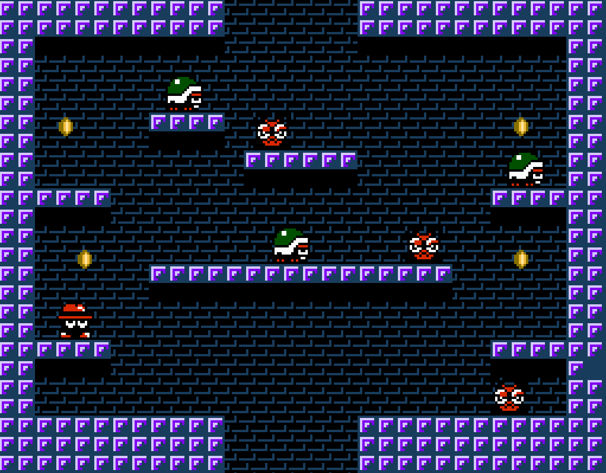

# Hatman in Cloudworld



A simple single-screen platformer for the NES written in 6502 Assembly! This was a project I did for Hackathon Dec 22 @ Red Hat. It was a ton of fun and I learned a lot.

This is a work in progress. I do hope to finish the game eventually, but right now its only a couple of levels. It is also just barely within the vblank timing budget so it needs a lot of slimming down.

## Requirements
You'll need the following:
* The CA65 assmbler (part of the CC65 suite) that you can [Download Here](https://cc65.github.io/getting-started.html)
* An NES emulator. I recommend either Messen or FCEUX.

## Build
If you have CA65 installed and on your path simply run:

```bash
$ make build
```

And a `.nes` file will be generated that you can run in your emulator. If you have Messen or FCEUX on your path you can run either of the following:

```bash
$ make run-messen
$ make run-fceux
```

And it will build and run in your emulator.

Note: if you are on Linux and installed FCEUX from the snap store you may need to do this:

```bash
$ make run-fceux-gui
```

## Hacking and Developing
This is Free Software so please feel free to fork and patches are very much welcome :) For development I *highly* recommend using the Messen emulator. Its debugger is fantastic and it really helps with tracking stuff down. Our make targets build with debug symbols so it makes things really nice to debug in Messen.

## Resources Consulted
I went from never having done any NES development before to a decent chunk of a game in a week, thanks to these awesome resources:

* [NES Development Enviroment by NESHacker](https://www.youtube.com/watch?v=RtY5FV5TrIU)
* [CA65 Macro Assembler Language Support for VSCode](https://github.com/tlgkccampbell/code-ca65)
* [NESHacker's Demo Project](https://github.com/NesHacker/DevEnvironmentDemo)
* [NESHacker's 6502 Assembly Crash Course](https://www.youtube.com/playlist?list=PLgvDB6LWam2WvoFvh8tlUqbqw92qWM0aP)
* [NES Game Programming Course](https://courses.pikuma.com/courses/take/nes-game-programming-tutorial)
* [NES Dev Wiki](https://www.nesdev.org/wiki/Nesdev_Wiki)
* [6502 OpCode List](http://www.6502.org/tutorials/6502opcodes.html)
* [NES LightBox](https://famicom.party/neslightbox/)
* [This made me completely insane for an hour](https://yeahexp.com/why-in-mos-6502-does-the-sbc-subtract-2-instead-of-1-the-first-time/)
* [Middle Engine NES Programming Guide](https://www.middle-engine.com/blog/posts/2020/06/23/programming-the-nes-the-6502-in-detail)
* [6502 Division Algos](https://mdfs.net/Info/Comp/6502/ProgTips/6502Divide)
* [Famistudio](https://github.com/BleuBleu/FamiStudio)
* [NEXXT Editor](https://frankengraphics.itch.io/nexxt)

## Special Thanks

Special shout-out to [Gustavo Pezzi](https://github.com/gustavopezzi) - his course [NES Game Programming](https://courses.pikuma.com/courses/take/nes-game-programming-tutorial) was my roadmap and really got me off to a great start. Much of the work in this project (the Actor system for example) scales-up and builds-on his work. He put together a fantastic course and I recommend it highly to anyone who wants to learn NES development.

Another special shout-out to the [Famistudio](https://github.com/BleuBleu/FamiStudio) team. Not only did I write the music and create the sound effects in their Famistudio GUI app, the sound in-game is played by the Famistudio engine for ca65 aseembly. I did not write the sound code, I used theirs and it is *excellent.* Big props to those folks for their fantastic work.

## Learning from this Repo
In the `snippets` directory you'll find a bunch of sequentially-numbered assembly files that aren't part of the game. These are the files I wrote as I was learning, step by step. They go through things like basic boot up, talking to the PPU, implementing controls, basic gravity, etc. If you were interested in learning those my be good simple resources to have a look at to see basic concepts in action without a lot of extra stuff going on.

## Project Layout
* `audio/` is where the music and sound FX files are stored. These were created in Famistudio and rendered to byte stream that are included into the program ROM
* `graphics/` is where the CHR-ROM (the tile set) is stored. This was created in NEXXT
* `includes/` is where all of the various components of the game are stored. In the root of `includes/` are things like constant definitions, zero page allocation, NES header, input management, and some useful macros for things like pointer allocation and copying. These are used all throughout the project.
* `includes/actors/` is where the Actor system and the actors themselves are defined. Everything in the game (player, enemies, coins, etc) are Actors. Actors are stored in a byte range in zero page. Every frame we iterate over all the actors and perform their logic, and collision, and sometimes redraw and defrag the actors if things have changed a lot (such as actor deletion). The most important files are:
    * `/includes/actors/actors.inc` - This is main actor framwork and all of the procs that manage the actor memory
    * `/includes/actors/api.inc` - is the "API" that all actors can make use of for things like gravity and collisions
* `levels/` - this is where the level definition metadata is stored. Each level is basically a map file (an NES nametable), a list of actors and their properties at level start, and a palette. When levels change the background, palette, and actor list pointers are updated and everything is bootstrapped
* `lib/` - This is where the [Famistudio Sound Engine](https://github.com/BleuBleu/FamiStudio) is stored. I did not write the code! There's no like package or lib manager for NES dev so I don't have any way to include this except to just put it in the repo. I do not own the copyright to this code. However, it is MIT licensed I am pretty sure it is OK for me to include it directly. If its not I'm happy to change things. Big respect to the Famistudio team!
* `maps/` - The nametables. These are the "screens" in the game like the levels, between level screens, title screen, etc. These were created in NEXXT